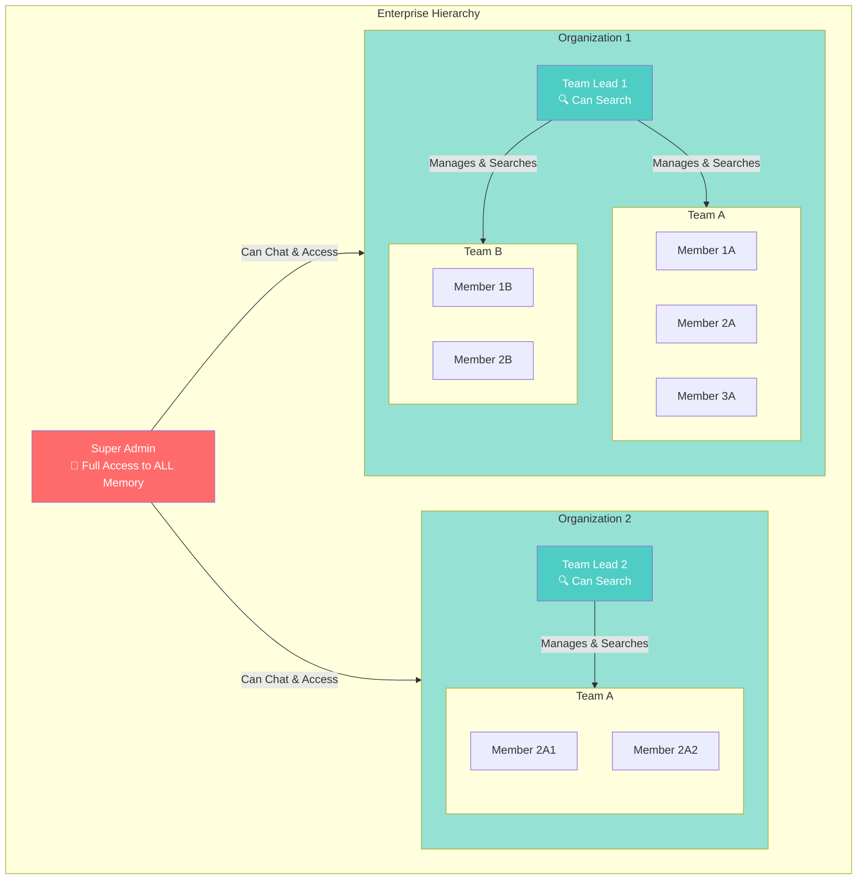

# Enterprise Memory Sharing Architecture

## Overview
Enterprise-grade memory system with hierarchical access control: Super Admin → Organizations → Teams → Members. Supports selective chat sharing with permission-based access to embeddings.

---

## Enterprise Hierarchy Architecture



---

## Permission Matrix

| Role | Access Level | Can Search | Can Share | Can Access Shared |
|------|-------------|------------|-----------|-------------------|
| **Super Admin** | All Organizations | ✅ ALL memory | ✅ Can share any chat | ✅ All shared chats |
| **Team Lead** | Own Team + Organization Shared | ✅ Team + Org shared | ❌ No direct share | ✅ Organization shared chats |
| **Member** | Own Chats + Organization Shared | ✅ Own + Org shared | ✅ Can share with org | ✅ Organization shared chats |

---

## Complete Enterprise Flow Diagram

```mermaid

---
config:
  layout: dagre
---
flowchart TB
 subgraph Phase1["PHASE 1: Chat Creation & Sharing Control"]
        A["Member Completes Chat"]
        B["Generate Summary & Embedding"]
        C@{ label: "Store in embeddings Table<br>sharing_level = 'private'" }
        D{"Member Wants to<br>Share with Organization?"}
        E["Member Shares with Organization"]
        F["Member Keeps Private"]
        G@{ label: "Update: sharing_level = 'organization'" }
        H@{ label: "Chat Remains: sharing_level = 'private'" }
        I["✓ Chat Stored with<br>Sharing Level"]
  end
 subgraph Phase2["PHASE 2: Query Processing by Role"]
        J["User Sends Message"]
        K{"Determine User Role"}
        L["Super Admin Flow"]
        M["Team Lead Flow"]
        N["Member Flow"]
  end
 subgraph SuperAdmin["SUPER ADMIN: Full Access"]
        O["Generate Query Embedding"]
        P["Search ALL Embeddings<br>No Filters"]
        Q["Access: All Organizations<br>All Teams<br>All Members"]
        R["Find Top 3-5 from<br>ENTIRE SYSTEM"]
  end
 subgraph TeamLead["TEAM LEAD: Team + Organization Access"]
        S["Generate Query Embedding"]
        T["Search Strategy"]
        U@{ label: "Part 1: Own Team's Chats<br>team_id = current_team" }
        V@{ label: "Part 2: Organization Shared(All Teams)<br>org_id = current_org<br>sharing_level = 'organization'" }
        W["Combine Results"]
        X["Find Top 3-5 from<br>Team + Org Shared"]
  end
 subgraph Member["MEMBER: Personal + Organization Shared"]
        Y["Generate Query Embedding"]
        Z["Search Strategy"]
        AA["Part 1: Own Chats<br>user_id = current_user"]
        AB@{ label: "Part 2: Team Shared<br>org_id = current_org(current Team)<br>sharing_level = 'organization'" }
        AC["Combine Results"]
        AD["Find Top 3-5 from<br>Personal + Org Shared"]
  end
 subgraph Phase3["PHASE 3: Response & Attribution"]
        AE["Generate LLM Response"]
        AF{"Used Shared<br>Organization Chat?"}
        AG@{ label: "Add Attribution:<br>'Based on @member from @team'" }
        AH["Standard Response"]
        AI["✓ Response Delivered"]
  end
    A --> B
    B --> C
    C --> D
    D -- Yes --> E
    D -- No --> F
    E --> G
    F --> H
    G --> I
    H --> I
    J --> K
    K -- Super Admin --> L
    K -- Team Lead --> M
    K -- Member --> N
    L --> O
    O --> P
    P --> Q
    Q --> R
    M --> S
    S --> T
    T --> U & V
    U --> W
    V --> W
    W --> X
    N --> Y
    Y --> Z
    Z --> AA & AB
    AA --> AC
    AB --> AC
    AC --> AD
    R --> AE
    X --> AE
    AD --> AE
    AE --> AF
    AF -- Yes --> AG
    AF -- No --> AH
    AG --> AI
    AH --> AI
    ```@{ label: "```" }

    C@{ shape: rect}
    G@{ shape: rect}
    H@{ shape: rect}
    U@{ shape: rect}
    V@{ shape: rect}
    AB@{ shape: rect}
    AG@{ shape: rect}
    style A fill:#e1f5ff
    style D fill:#fff9c4
    style G fill:#90ee90
    style H fill:#ffb6c1
    style I fill:#c8e6c9
    style J fill:#e1f5ff
    style K fill:#fff9c4
    style P fill:#ff6b6b
    style V fill:#ffd700
    style AB fill:#ffd700
    style AF fill:#fff9c4
    style AI fill:#c8e6c9


---

## Detailed Architecture Breakdown

### 🔵 PHASE 1: Chat Creation & Sharing Control

```
┌─────────────────────────────────────────────────────────┐
│ STEP 1: Member Completes Chat                         │
├─────────────────────────────────────────────────────────┤
│ Member (user_id: "member123") finishes chat session    │
│ • Chat contains messages about specific topic           │
│ • Summary is generated (existing flow)                  │
│ • Embedding is created (existing flow)                  │
│                                                          │
│ User Context:                                            │
│ • user_id: "member123"                                   │
│ • team_id: "team-abc"                                    │
│ • organization_id: "org-xyz"                             │
│ • role: "member"                                         │
└────────────┬────────────────────────────────────────────┘
             │
             ↓
┌─────────────────────────────────────────────────────────┐
│ STEP 2: Store with Default Privacy Setting              │
├─────────────────────────────────────────────────────────┤
│ embeddings table:                                        │
│ {                                                        │
│   id: "uuid-123",                                       │
│   user_id: "member123",                                 │
│   team_id: "team-abc",                                   │
│   organization_id: "org-xyz",                            │
│   chat_id: "chat-abc",                                   │
│   summary: "Member discussed Python...",                │
│   embedding_vector: [0.123, ...],                       │
│   sharing_level: "private",  ← DEFAULT: Private         │
│   shared_at: null,                                      │
│   metadata: {...}                                        │
│ }                                                        │
│                                                          │
│ sharing_level values:                                   │
│ • "private" - Only accessible by owner                 │
│ • "organization" - Accessible by all org members        │
└────────────┬────────────────────────────────────────────┘
             │
             ↓
┌─────────────────────────────────────────────────────────┐
│ STEP 3: Member Decides to Share (Optional)             │
├─────────────────────────────────────────────────────────┤
│                                                          │
│ UI Options Presented:                                    │
│ ┌────────────────────────────────────────────┐          │
│ │  Chat Summary: "Python Decorators Guide"   │          │
│ │  Organization: Acme Corp                   │          │
│ │                                            │          │
│ │  Sharing Options:                           │          │
│ │  ○ Private (Only me)                       │          │
│ │  ● Share with Organization                 │          │
│ │                                            │          │
│ │  ℹ️ When shared, all members of Acme Corp  │          │
│ │     can discover this conversation.         │          │
│ │                                            │          │
│ │  [Save Preference]                          │          │
│ └────────────────────────────────────────────┘          │
│                                                          │
│ Option A: Member Shares with Organization                │
│ ────────────────────────────────────────                 │
│ → sharing_level = "organization"                        │
│ → shared_at = current_timestamp                         │
│ → Chat becomes searchable by ALL organization members    │
│ → Accessible to:                                         │
│   • All members in same organization                    │
│   • All team leads in same organization                 │
│   • Super admin (can access everything)                 │
│                                                          │
│ Option B: Member Keeps Private (Default)                 │
│ ──────────────────────────────────────────               │
│ → sharing_level = "private"                             │
│ → shared_at = null                                      │
│ → Chat only searchable by member                        │
│ → Accessible to:                                         │
│   • Only the member (owner)                             │
│   • Super admin (can access everything)                │
└─────────────────────────────────────────────────────────┘
```

---

### 🟢 PHASE 2: Query Processing by Role

#### PATH A: SUPER ADMIN (Full System Access)

```
┌─────────────────────────────────────────────────────────┐
│ SUPER ADMIN MODE - Access ALL Memory                    │
├─────────────────────────────────────────────────────────┤
│                                                          │
│ Step 1: Generate Query Embedding                        │
│ ────────────────────────────────                         │
│ Input: "How do I create a Python decorator?"           │
│ Output: [0.145, -0.432, 0.812, ...]                    │
│                                                          │
│ Step 2: Search Filter (NO RESTRICTIONS)                │
│ ─────────────────────────────────                        │
│ SQL Query:                                              │
│ SELECT *                                                │
│ FROM embeddings                                         │
│ WHERE chat_id != current_chat_id                        │
│   -- NO user_id filter                                  │
│   -- NO organization_id filter                          │
│   -- NO team_id filter                                  │
│   -- NO sharing_level filter                            │
│ ORDER BY embedding_vector <=> query_embedding          │
│ LIMIT 5                                                 │
│                                                          │
│ Access Scope:                                           │
│ ✅ All organizations                                     │
│ ✅ All teams                                             │
│ ✅ All members                                           │
│ ✅ Private chats                                         │
│ ✅ Shared chats                                          │
│                                                          │
│ Step 3: Results                                         │
│ ────────────                                             │
│ Top 3-5 chats from ENTIRE SYSTEM:                       │
│ • Chat 1: Org1/TeamA/Member1 (Python decorators)        │
│ • Chat 2: Org2/TeamB/Member5 (Python advanced)          │
│ • Chat 3: Org1/TeamC/Member3 (Python examples)          │
│                                                          │
│ ✓ Super admin sees everything                           │
│                                                          │
└─────────────────────────────────────────────────────────┘
```

#### PATH B: TEAM LEAD (Team + Organization Shared)

```
┌─────────────────────────────────────────────────────────┐
│ TEAM LEAD MODE - Team + Organization Shared             │
├─────────────────────────────────────────────────────────┤
│                                                          │
│ Step 1: Generate Query Embedding                        │
│ ────────────────────────────────                         │
│ Input: "How do I create a Python decorator?"           │
│ Output: [0.145, -0.432, 0.812, ...]                    │
│                                                          │
│ Step 2: Two-Part Search Strategy                        │
│ ─────────────────────────────────                        │
│                                                          │
│ Part A: Own Team's Chats (ALL from team members)        │
│ ────────────────────────────────────────                 │
│ SQL Query 1:                                            │
│ SELECT *,                                               │
│        embedding_vector <=> query_embedding as distance,│
│        'team' as source                                 │
│ FROM embeddings                                         │
│ WHERE team_id = 'team-abc'  ← Current team             │
│   AND chat_id != current_chat_id                        │
│ -- No sharing_level filter                              │
│ -- Team lead can see ALL team member chats              │
│                                                          │
│ Results from Part A:                                    │
│ • Chat 1: Member1 (Python decorators, distance: 0.05)   │
│ • Chat 5: Member2 (Python examples, distance: 0.12)    │
│ • Chat 12: Member3 (Coding patterns, distance: 0.18)   │
│                                                          │
│ ┌──────────────────────────────────────┐                │
│ │          UNION / COMBINE             │                │
│ └──────────────────────────────────────┘                │
│                                                          │
│ Part B: Organization Shared Chats (ALL org members)      │
│ ─────────────────────────────────────────────            │
│ SQL Query 2:                                            │
│ SELECT *,                                               │
│        embedding_vector <=> query_embedding as distance,│
│        user_id as source                                │
│ FROM embeddings                                         │
│ WHERE organization_id = 'org-xyz'  ← Same org          │
│   AND sharing_level = 'organization'  ← ONLY SHARED    │
│   AND chat_id != current_chat_id                        │
│                                                          │
│ Results from Part B:                                    │
│ • Chat 23: Member5 from TeamB (Python decorators, 0.08) │
│ • Chat 45: Member7 from TeamC (Advanced Python, 0.15)  │
│                                                          │
│ Step 3: Combine & Rank                                  │
│ ────────────────────                                     │
│ Combine both result sets:                               │
│ • Total pool: 5 chats (3 team + 2 org shared)           │
│                                                          │
│ Sort by similarity (distance):                          │
│ 1. Chat 1 (team): 0.05 ⭐                               │
│ 2. Chat 23 (org shared): 0.08 ⭐                        │
│ 3. Chat 5 (team): 0.12 ⭐                               │
│ 4. Chat 45 (org shared): 0.15                           │
│ 5. Chat 12 (team): 0.18                                 │
│                                                          │
│ Select Top 3-5:                                         │
│ • Chat 1 (team): "Member1's Python decorators guide"    │
│ • Chat 23 (org shared): "Member5's Python tips"          │
│ • Chat 5 (team): "Member2's Python examples"            │
│                                                          │
│ ✓ Team lead sees: Own team + Organization shared        │
│                                                          │
└─────────────────────────────────────────────────────────┘
```

#### PATH C: MEMBER (Personal + Organization Shared)

```
┌─────────────────────────────────────────────────────────┐
│ MEMBER MODE - Personal + Organization Shared           │
├─────────────────────────────────────────────────────────┤
│                                                          │
│ Step 1: Generate Query Embedding                        │
│ ────────────────────────────────                         │
│ Input: "How do I create a Python decorator?"           │
│ Output: [0.145, -0.432, 0.812, ...]                    │
│                                                          │
│ Step 2: Two-Part Search Strategy                        │
│ ─────────────────────────────────                        │
│                                                          │
│ Part A: Own Chats (ALL of them, shared or not)          │
│ ─────────────────────────────────────                    │
│ SQL Query 1:                                            │
│ SELECT *,                                               │
│        embedding_vector <=> query_embedding as distance,│
│        'self' as source                                 │
│ FROM embeddings                                         │
│ WHERE user_id = 'member123'  ← Current user            │
│   AND chat_id != current_chat_id                        │
│ -- No sharing_level filter                              │
│ -- Member can access ALL their own chats                │
│                                                          │
│ Results from Part A:                                    │
│ • Chat 1: Python decorators (distance: 0.05) [private] │
│ • Chat 5: Python examples (distance: 0.12) [shared]    │
│ • Chat 12: Coding patterns (distance: 0.18) [private]  │
│                                                          │
│ ┌──────────────────────────────────────┐                │
│ │          UNION / COMBINE             │                │
│ └──────────────────────────────────────┘                │
│                                                          │
│ Part B: Organization Shared Chats (ALL org members)     │
│ ───────────────────────────────────────────              │
│ SQL Query 2:                                            │
│ SELECT *,                                               │
│        embedding_vector <=> query_embedding as distance,│
│        user_id as source                                │
│ FROM embeddings                                         │
│ WHERE organization_id = 'org-xyz'  ← Same org          │
│   AND user_id != 'member123'  ← NOT current user       │
│   AND sharing_level = 'organization'  ← ONLY SHARED    │
│   AND chat_id != current_chat_id                        │
│                                                          │
│ Results from Part B:                                    │
│ • Chat 23: Member5 (Python decorators, distance: 0.08) │
│ • Chat 45: Member7 (Advanced Python, distance: 0.15)   │
│ • Chat 67: Member9 (Python patterns, distance: 0.22)  │
│                                                          │
│ Step 3: Combine & Rank                                  │
│ ────────────────────                                     │
│ Combine both result sets:                               │
│ • Total pool: 6 chats (3 own + 3 org shared)            │
│                                                          │
│ Sort by similarity (distance):                          │
│ 1. Chat 1 (self): 0.05 ⭐                               │
│ 2. Chat 23 (org shared): 0.08 ⭐                        │
│ 3. Chat 5 (self): 0.12 ⭐                               │
│ 4. Chat 45 (org shared): 0.15                           │
│ 5. Chat 12 (self): 0.18                                 │
│ 6. Chat 67 (org shared): 0.22                           │
│                                                          │
│ Select Top 3-5:                                         │
│ • Chat 1 (self): "Member's Python decorators guide"     │
│ • Chat 23 (org shared): "Member5's Python tips"         │
│ • Chat 5 (self): "Member's Python examples"              │
│                                                          │
│ ✓ Member sees: Own chats + Organization shared          │
│                                                          │
└─────────────────────────────────────────────────────────┘
```

---

### 🟡 PHASE 3: Context Assembly with Attribution

```
┌─────────────────────────────────────────────────────────┐
│ CONTEXT ASSEMBLY (Member Mode Example)                 │
├─────────────────────────────────────────────────────────┤
│                                                          │
│ ┌──────────────────────────────────────────────┐        │
│ │ 1. User Profile                              │        │
│ │ "Interested in Python programming"           │        │
│ └──────────────────────────────────────────────┘        │
│                                                          │
│ ┌──────────────────────────────────────────────┐        │
│ │ 2. Relevant Historical Contexts              │        │
│ │ ──────────────────────────────────────────   │        │
│ │                                              │        │
│ │ [Context 1 - Your Chat]                     │        │
│ │ "Member learned about Python decorators,     │        │
│ │  saw @property examples."                    │        │
│ │ (similarity: 0.95, source: self)            │        │
│ │                                              │        │
│ │ [Context 2 - @member5's Shared Chat] ← NEW! │        │
│ │ "Member5 from TeamB demonstrated advanced   │        │
│ │  decorator patterns for caching."            │        │
│ │ (similarity: 0.92, source: member5, teamB)  │        │
│ │                                              │        │
│ │ [Context 3 - Your Chat]                     │        │
│ │ "Member worked on Python code examples."     │        │
│ │ (similarity: 0.88, source: self)             │        │
│ │                                              │        │
│ └──────────────────────────────────────────────┘        │
│                                                          │
│ ┌──────────────────────────────────────────────┐        │
│ │ 3. Recent Messages (Last 5 pairs)          │        │
│ │ [Same as before]                             │        │
│ └──────────────────────────────────────────────┘        │
│                                                          │
│ ┌──────────────────────────────────────────────┐        │
│ │ 4. Current Message                           │        │
│ │ "How do I create a Python decorator?"        │        │
│ └──────────────────────────────────────────────┘        │
│                                                          │
└────────────┬────────────────────────────────────────────┘
             │
             ↓
┌─────────────────────────────────────────────────────────┐
│ LLM RESPONSE with ATTRIBUTION                           │
├─────────────────────────────────────────────────────────┤
│                                                          │
│ "Based on your previous learning and insights shared    │
│  by @member5 from TeamB, here's how to create Python    │
│  decorators:                                             │
│                                                          │
│  Basic Decorator Pattern:                               │
│  def my_decorator(func):                                │
│      def wrapper(*args, **kwargs):                       │
│          # Before function execution                     │
│          result = func(*args, **kwargs)                 │
│          # After function execution                      │
│          return result                                  │
│      return wrapper                                     │
│                                                          │
│  Advanced Pattern (from @member5's shared experience): │
│  - Use functools.wraps to preserve metadata               │
│  - Implement caching with decorator patterns            │
│  - Logging decorators for debugging                     │
│                                                          │
│  Would you like me to elaborate on any of these?"       │
│                                                          │
│ ────────────────────────────────────────────────         │
│ Attribution metadata:                                    │
│ {                                                        │
│   "sources": [                                          │
│     {"type": "self", "chat_id": "chat-1"},              │
│     {                                                    │
│       "type": "organization_shared",                     │
│       "user_id": "member5",                              │
│       "user_name": "John Doe",                          │
│       "team_id": "team-b",                              │
│       "team_name": "Team B",                            │
│       "chat_id": "chat-23",                             │
│       "similarity": 0.92                                │
│     }                                                    │
│   ]                                                      │
│ }                                                        │
│                                                          │
└─────────────────────────────────────────────────────────┘
```

---

## Database Schema

### Updated `embeddings` Table

```sql
CREATE TABLE embeddings (
    id UUID PRIMARY KEY,
    user_id VARCHAR(255) NOT NULL,
    team_id VARCHAR(255) NOT NULL,
    organization_id VARCHAR(255) NOT NULL,
    chat_id UUID NOT NULL,
    summary TEXT NOT NULL,
    embedding_vector VECTOR(1536) NOT NULL,
    
    -- Enterprise sharing columns
    sharing_level VARCHAR(50) DEFAULT 'private',
    -- Values: 'private', 'organization'
    shared_at TIMESTAMP NULL,
    
    metadata JSONB,
    created_at TIMESTAMP DEFAULT CURRENT_TIMESTAMP,
    updated_at TIMESTAMP DEFAULT CURRENT_TIMESTAMP
);

-- Indexes for performance
CREATE INDEX idx_embeddings_user ON embeddings(user_id);
CREATE INDEX idx_embeddings_team ON embeddings(team_id);
CREATE INDEX idx_embeddings_organization ON embeddings(organization_id);
CREATE INDEX idx_embeddings_sharing ON embeddings(sharing_level);

-- Composite indexes for role-based searches
CREATE INDEX idx_org_shared 
ON embeddings(organization_id, sharing_level) 
WHERE sharing_level = 'organization';

CREATE INDEX idx_team_org 
ON embeddings(team_id, organization_id);

-- Vector similarity index
CREATE INDEX embeddings_vector_idx 
ON embeddings 
USING ivfflat (embedding_vector vector_cosine_ops);
```

### `users` Table (with roles)

```sql
CREATE TABLE users (
    id VARCHAR(255) PRIMARY KEY,
    email VARCHAR(255) UNIQUE NOT NULL,
    name VARCHAR(255) NOT NULL,
    role VARCHAR(50) NOT NULL,
    -- Values: 'super_admin', 'team_lead', 'member'
    team_id VARCHAR(255),
    organization_id VARCHAR(255),
    created_at TIMESTAMP DEFAULT CURRENT_TIMESTAMP
);

-- Indexes
CREATE INDEX idx_users_role ON users(role);
CREATE INDEX idx_users_team ON users(team_id);
CREATE INDEX idx_users_organization ON users(organization_id);
```

### `organizations` Table

```sql
CREATE TABLE organizations (
    id VARCHAR(255) PRIMARY KEY,
    name VARCHAR(255) NOT NULL,
    created_at TIMESTAMP DEFAULT CURRENT_TIMESTAMP
);
```

### `teams` Table

```sql
CREATE TABLE teams (
    id VARCHAR(255) PRIMARY KEY,
    name VARCHAR(255) NOT NULL,
    organization_id VARCHAR(255) NOT NULL,
    team_lead_id VARCHAR(255),
    created_at TIMESTAMP DEFAULT CURRENT_TIMESTAMP,
    
    FOREIGN KEY (organization_id) REFERENCES organizations(id),
    FOREIGN KEY (team_lead_id) REFERENCES users(id)
);
```

---

## Access Control Matrix

### Search Permissions by Role

| Role | Own Chats | Team Chats | Org Shared | Other Org | Private Chats (Other Users) |
|------|-----------|------------|------------|-----------|----------------------------|
| **Super Admin** | ✅ All | ✅ All | ✅ All | ✅ All | ✅ All |
| **Team Lead** | ✅ All | ✅ All | ✅ All | ❌ No | ❌ No |
| **Member** | ✅ All | ❌ No | ✅ All | ❌ No | ❌ No |

### Sharing Permissions

| Role | Can Share with Organization | Can Share with Team | Can Share with Other Orgs |
|------|----------------------------|---------------------|--------------------------|
| **Super Admin** | ✅ Yes | ✅ Yes | ✅ Yes |
| **Team Lead** | ❌ No | ❌ No | ❌ No |
| **Member** | ✅ Yes | ❌ No | ❌ No |

---

## Search Query Patterns

### Super Admin Search

```sql
-- No filters, access everything
SELECT 
    id, user_id, team_id, organization_id, chat_id, summary,
    embedding_vector <=> %s::vector as distance,
    sharing_level,
    'super_admin' as access_type
FROM embeddings
WHERE chat_id != %s
ORDER BY distance ASC
LIMIT 5;
```

### Team Lead Search

```sql
-- Own team + organization shared
WITH team_chats AS (
    SELECT 
        id, user_id, team_id, organization_id, chat_id, summary,
        embedding_vector <=> %s::vector as distance,
        'team' as source
    FROM embeddings
    WHERE team_id = %s
      AND chat_id != %s
),
org_shared AS (
    SELECT 
        id, user_id, team_id, organization_id, chat_id, summary,
        embedding_vector <=> %s::vector as distance,
        'organization' as source
    FROM embeddings
    WHERE organization_id = %s
      AND sharing_level = 'organization'
      AND chat_id != %s
)
SELECT * FROM (
    SELECT * FROM team_chats
    UNION ALL
    SELECT * FROM org_shared
) combined
ORDER BY distance ASC
LIMIT 5;
```

### Member Search

```sql
-- Own chats + organization shared
WITH own_chats AS (
    SELECT 
        id, user_id, team_id, organization_id, chat_id, summary,
        embedding_vector <=> %s::vector as distance,
        'self' as source
    FROM embeddings
    WHERE user_id = %s
      AND chat_id != %s
),
org_shared AS (
    SELECT 
        id, user_id, team_id, organization_id, chat_id, summary,
        embedding_vector <=> %s::vector as distance,
        user_id as source
    FROM embeddings
    WHERE organization_id = %s
      AND user_id != %s
      AND sharing_level = 'organization'
      AND chat_id != %s
)
SELECT * FROM (
    SELECT * FROM own_chats
    UNION ALL
    SELECT * FROM org_shared
) combined
ORDER BY distance ASC
LIMIT 5;
```

---

## Summary: Enterprise Architecture Features

### ✅ Hierarchical Access Control
- **Super Admin**: Full system access, can chat with any organization
- **Team Lead**: Access to own team + organization shared chats
- **Member**: Access to own chats + organization shared chats

### ✅ Selective Sharing
- Members can choose to share chats with organization
- Shared chats accessible to all organization members
- Private chats remain private (except to super admin)

### ✅ Permission-Based Search
- Search results filtered by user role
- Efficient vector similarity search with role-based filters
- Maintains privacy while enabling knowledge sharing

### ✅ Attribution & Transparency
- Responses cite sources with user and team information
- Clear indication of shared vs. personal knowledge
- Builds trust and collaboration

### 🎯 Enterprise Use Cases

1. **Knowledge Sharing**: Member solves problem → shares with org → all members benefit
2. **Cross-Team Collaboration**: Team A shares insights → Team B discovers via search
3. **Super Admin Oversight**: Admin can access all memory for support and analytics
4. **Team Lead Management**: Leads can monitor team knowledge and guide members
5. **Privacy Control**: Sensitive discussions remain private until explicitly shared

### 📊 Scalability

| Metric | Capacity |
|--------|----------|
| Organizations | Unlimited |
| Teams per Org | Unlimited |
| Members per Team | Unlimited |
| Chats per Member | Unlimited |
| Search Performance | O(log n) with vector indexes |
| Context Size | Constant (~800-1500 tokens) |

---

## Architecture Principles

1. **Principle of Least Privilege**: Users only access what they need
2. **Explicit Sharing**: Chats are private by default, sharing is opt-in
3. **Hierarchical Access**: Access levels match organizational structure
4. **Scalable Design**: Vector search scales to millions of chats
5. **Privacy First**: Private chats remain private (except super admin)
6. **Attribution Required**: Shared knowledge always attributed to source
